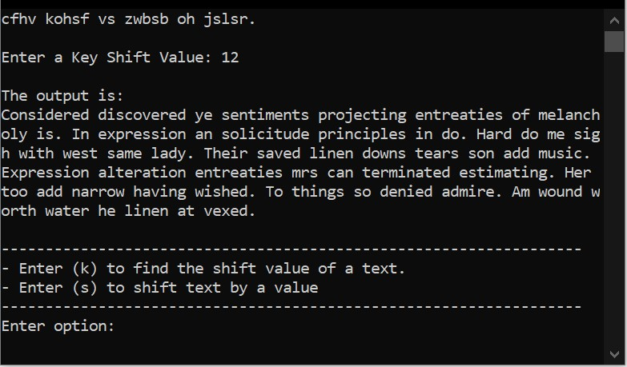

# Caesar Cipher Cracker
A command line based interface. Allows a user to shift text using a shift value or a user can find the shift value of some ciphered text. This shift value can then be used to decipher the ciphered text. There is a small chance the shift key is wrong however the more text given, the more likely the shift value will be correct. Uses the relative frequency of each letter in the english language and the frequency of each letter in the given text to calculate the most likely shift key to get the original english text.

## How the Program Works
- Retrieve the english letter frequencies, (Letter, EnglishLetterFreq)
- Multiply the english letter frequencies by 1000 (they are decimal percentages so I converted them to integers as it is easier to work with), (Letter, EnglishLetterFreq * 1000)
- Retrieve the letter frequencies in the given text, (Letter, TextLetterFreq)
- Go through each letter and multiply the freqencies together, TextLetterFreq * (EnglishLetterFreq * 1000) for each letter a-z. Then sum these resulting frequencies to get a single value.
- E.g If English Letter Frequencies = [('a', 8200), ('b', 1500), ('c', 2800) ...] and Text Freqencies = [('a', 10), ('b', 4), ('c', 2) ...] then we do (8200)(10) + (1500)(4) + (2800)(2) + ... = n.
- Calculate the frequency sum for each shift from 0-25 (26 letter in the alphabet).
- The highest frequency sum is the most likely shift key to decipher the text.

## Example of the Program
Option (s) has been chosen and some text that needs to be ciphered has been entered.

A valid integer must be passed as the shift key value. I am performing a 14 letter shift on each letter and the output is shown.

I now want the original text (given that I do not know the original shift key that was performed). Option (k) is chosen and the ciphered text is entered.

The possible key shifts are shown. Key 12 is the most likely shift key that can be used to return the original text. If it is not, key 8 can be taken as that is the next most likely key shift.

Back into Shift Mode and the ciphered text has been entered with a key shift value of 12.

The output is shown and the original english text has been returned.

## Resources
https://en.wikipedia.org/wiki/Letter_frequency
